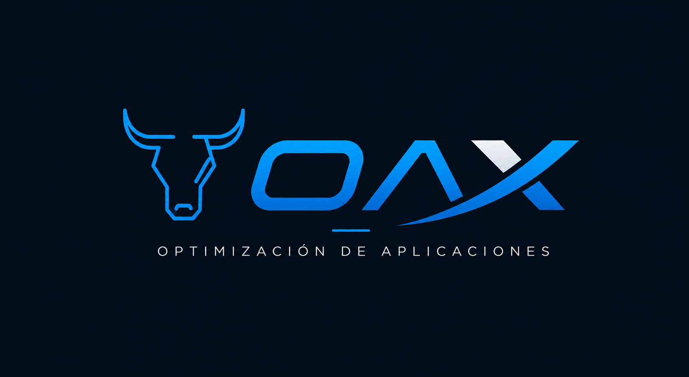
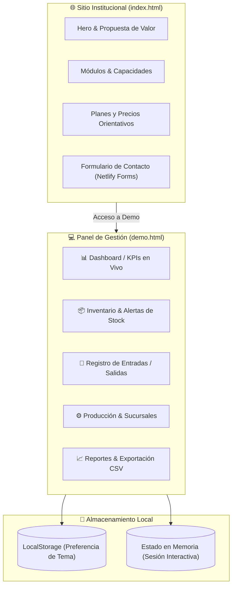

<div align="center">



### Sistema de Gestión Comercial y Landing Institucional para PyMEs

[](https://github.com/Matydesousa/oax-business-management-demo/actions/workflows/site.yml)
[](index.html)
[](styles.css)
[](demo.js)
[](netlify.toml)
[](LICENSE)

---

Sitio institucional y demostración interactiva de un software de gestión integral pensado para pequeños comercios y empresas en crecimiento.

</div>

## 📌 Descripción

El proyecto expone cómo una solución a medida puede centralizar operaciones críticas en una única interfaz moderna y accesible: control de inventario, movimientos de stock, transferencias entre sucursales, simulación de producción y métricas recalculadas durante la sesión.

Toda la lógica de la demo se ejecuta íntegramente en el cliente (navegador) sin requerir dependencias externas ni compiladores.

---

## 🚀 Arquitectura y Flujo



---

## ✨ Características Principales

| Módulo / Funcionalidad | Descripción |
| :--- | :--- |
| **🌐 Landing Institucional** | Presentación comercial responsive, detalles de servicios, esquema de precios y confirmación de contacto. |
| **📊 Dashboard Operativo** | Indicadores en vivo de stock total, valor monetario estimado, alertas de quiebre y productos críticos. |
| **📦 Gestión de Inventario** | Catálogo con filtros por categoría, búsqueda en tiempo real, ordenamiento, paginación y avisos de stock mínimo. |
| **🔄 Movimientos y Sucursales** | Simulación de ingresos/egresos y transferencias entre sucursales con ajuste automático de existencias. |
| **⚙️ Módulo de Producción** | Generación de órdenes de armado con validación de insumos y actualización de productos terminados. |
| **📈 Reportes y Exportación** | Filtros de transacciones por rango de fechas y descarga directa de resúmenes en formato **CSV**. |
| **🌗 Accesibilidad y Tema** | Soporte de Modo Claro / Oscuro con persistencia en `localStorage`, navegación completa por teclado y roles ARIA. |

---

## 🛠️ Tecnologías

- **HTML5**: Estructura semántica, formularios con validación nativa y accesibilidad (a11y).
- **CSS3 Moderno**: Variables CSS para temas dinámicos, Flexbox, Grid y diseño responsive con puntos de corte adaptativos.
- **JavaScript (Vanilla ES6+)**: Manipulación del DOM, gestión del estado de la sesión en memoria y exportación de archivos en el cliente.
- **Netlify**: Soporte de formularios estáticos y cabeceras de seguridad mediante `netlify.toml`.

> **Sin dependencias pesadas**: No requiere Node.js para ejecutarse, ni librerías externas ni pasos de compilación.

---

## 💻 Ejecución Local

Podés abrir `index.html` directamente con doble clic en tu navegador. Para simular un entorno servido vía HTTP:

```powershell
# Iniciar un servidor local ligero
py -m http.server 8080
```

Luego abrí [http://localhost:8080](http://localhost:8080) en tu navegador.

---

## 🧪 Pruebas y Validación

El proyecto incluye verificaciones automatizadas nativas con el test runner de Node.js que aseguran la integridad del código y los enlaces internos:

```powershell
# Validar sintaxis JavaScript
node --check script.js
node --check demo.js

# Ejecutar suite de pruebas de estructura y recursos
node --test tests/site.test.mjs
```

---

## 📂 Estructura del Repositorio

```text
oax-business-management-demo/
├── .github/
│   └── workflows/
│       └── site.yml         # Integración continua (GitHub Actions)
├── assets/                  # Identidad visual, logotipos e iconos
├── tests/
│   └── site.test.mjs        # Suite de pruebas automatizadas
├── index.html               # Landing page institucional
├── styles.css               # Estilos de la landing page
├── script.js                # Lógica e interactividad de la landing
├── demo.html                # Interfaz del panel de gestión
├── demo.css                 # Estilos y temas (dark/light) de la demo
├── demo.js                  # Manejo de datos y operaciones de la demo
├── gracias.html             # Página de agradecimiento post-contacto
├── netlify.toml             # Reglas de despliegue y cabeceras HTTP
├── LICENSE                  # Licencia de código abierto MIT
└── README.md                # Documentación del proyecto
```

---

## 👤 Autor

Desarrollado como proyecto de portfolio por **[Matias De Sousa](https://github.com/Matydesousa)**.

La marca OAX y sus recursos visuales forman parte de esta demostración interactiva de portfolio.

---

## 📄 Licencia

El código de este proyecto se distribuye bajo la licencia **[MIT](LICENSE)**. La marca OAX y sus recursos visuales se incluyen únicamente como parte de esta demostración de portfolio.
